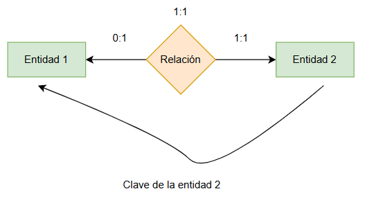
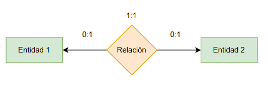
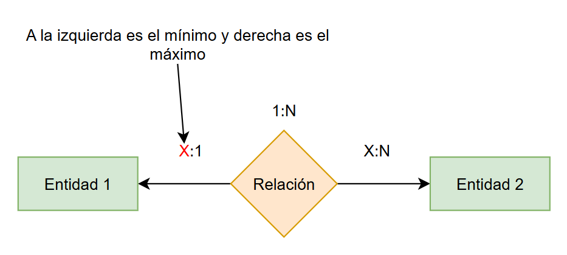
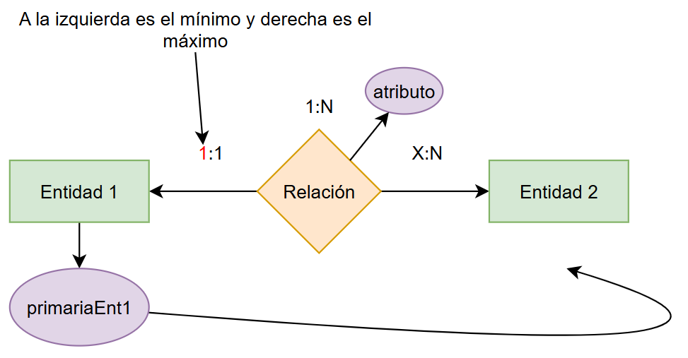
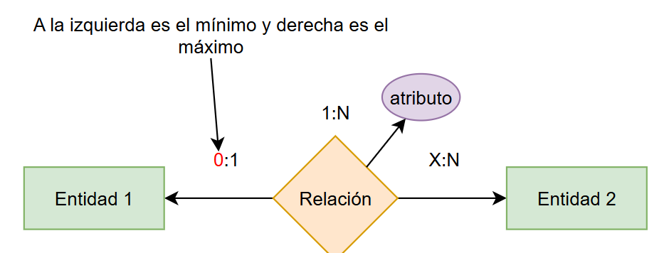

# Base de datos: cardinalidad, normalización, transformación de ER-Relacional y SQL.

## Cardinalidad de una relación

### Cardinalidad 1:1
Cuando un registro se relaciona sólamente con otro de otra tabla y viceversa.

Ejemplo:
- Una persona solo puede tener un pasaporte y uno pasaporte solo le pertenece a una sóla persona.

Esto depende de igual manera el diseño de la base de datos, porque una persona puede tener varios pasaportes, como en el caso de que uno esta activo y el resto expirados o en el caso de que posea pasaportes de diferentes nacionalidades.

- Un usuario solo puede tener una cédula.
- Un usurio solo tiene un rol.
- Un usuario tiene una sola dirección

  

---

### Cardinalidad 1:N
Un solo registro de una tabla A iene asociaciones con varios registros de la tabla B, los registros de la tabla B solo puede asociarse al registro de la tabla **A**.

Ejemplo:
- Un usuario tiene muchas cuentas.
- Una compra les pertenece a un usuario

  

### Cardinalidad N:M

Cuando varios registros de una tabla pueden relacionarse con varios registros de otra tabla.

- Un estudiante puede inscribirse en muchos cursos y Un curso tiene muchos estudiantes.

- Un comprador puede comprar varios producto y un producto puede ser comprado por varios compradores.

- Un paciente puede ser atentido por muchos médicos y un médico puede atender a muchos pacientes.

  

### Cardinalidad 0:1
Se usa cuando una entidad puede o no tener una relación, y si la tiene, es solo una.

- Una cuenta de red social solo puede tener una foto de perfil o no tener ninguna.
- Un usuario puede tener licencia de conducir o nada.

### Cardinalidad 0:N

Se usa cuando una entidad puede no tener ninguna relación, o puede tener muchas, sin un límite máximo.

- Un cliente puede no haber hecho pedidos o haber hecho muchos pedidos.

- Una categoria creada puede no tener productos o puede estar asociada con muchos.

## Definición de la cardinalidad de una base de datos

## Normalización de una base de datos

### Normalización 1FN

- Evitar grupos en a nivel de fila y columnas. 
- Evitar los valores no atómicos, como por ejemplo una columna con datos separas por comas:
- Crear una tabla separada para cada grupo de registros de datos.
- Cada registro debe ser identificado por una llave primaria.

Valores no atómicos ❌:

| id | nombre | teléfonos |
| -- | ------ | --------- |
| 1  | Ana    | 8888,9999 |

Campos repetidos o multivaluados ❌: 

| id_persona | nombre | telefono1 | telefono2 | telefono3 |
| ---------- | ------ | --------- | --------- | --------- |
| 1          | Ana    | 8888      | 9999      | 7777      |

Registros no tiene llave primaria ❌
| nombre | correo                                |
| ------ | ------------------------------------- |
| Ana    | [ana@gmail.com](mailto:ana@gmail.com) |
| Ana    | [ana@gmail.com](mailto:ana@gmail.com) |

Ejemplo normalizado de una bd ✔️

Tabla `persona`

| id_persona (PK) | nombre |
| --------------- | ------ |
| 1               | Ana    |

Tabla `Teléfono`

| id_telefono (PK) | id_persona (FK) | telefono |
| ---------------- | --------------- | -------- |
| 1                | 1               | 8888     |
| 2                | 1               | 9999     |

### Normalización 2FN

Si una clave principal es una clave compuesta, el atributo que no es clave debe depender de cada columna de esa clave compuesta.

- Estar en 1FN (Primera forma normal)
- Identificar Claves Compuestas: Si tu tabla tiene una sola columna como PK (Clave Primaria), y ya está en 1FN, automáticamente está en 2FN.
- Si hay una columna que no se relaciona con todas las columnas de la clave compuesta, no está en 2fn.

Tabla con columna que depende parcialmente a la clave primaria ❌:

| id_estudiante | id_curso | nombre_estudiante | nombre_curso | creditos |
| ------------- | -------- | ----------------- | ------------ | -------- |
| 1             | 101      | Juan Pérez        | Matemáticas  | 4        |
| 1             | 102      | Juan Pérez        | Física       | 3        |
| 2             | 101      | Ana López         | Matemáticas  | 4        |
| 2             | 103      | Ana López         | Programación | 5        |

- nombre_estudiante depende solo de id_estudiante

- nombre_curso y creditos dependen solo de id_curso

- Hay dependencia parcial → NO cumple 2FN

Normalización a 2FN ✔️

*Tabla estudiante*

| id_estudiante | nombre_estudiante |
| ------------- | ----------------- |
| 1             | Juan Pérez        |
| 2             | Ana López         |

*Tabla curso*

| id_curso | nombre_curso | creditos |
| -------- | ------------ | -------- |
| 101      | Matemáticas  | 4        |
| 102      | Física       | 3        |
| 103      | Programación | 5        |

*Tabla inscripción*

| id_estudiante | id_curso |
| ------------- | -------- |
| 1             | 101      |
| 1             | 102      |
| 2             | 101      |
| 2             | 103      |

### Normalización 3FN

- Debe cumplor la primera y segunda forma normal.
- Una columna de una tabla no puede depender de otra columna que no sea clave.
- Evitar dependencia transitiva, si B depende de A y C depende de B, B no debería depender de A en una misma tabla.

Ejemplo de dependencia transitiva ❌

*Tabla departemento*
| id_empleado | nombre       | id_departamento | nombre_departamento |
| ----------- | ------------ | --------------- | ------------------- |
| 1           | Juan Pérez   | 10              | Contabilidad        |
| 2           | Ana López    | 20              | Recursos Humanos    |
| 3           | Carlos Gómez | 10              | Contabilidad        |

Normalización 3FN ✔️

*Tabla empleado*

| id_empleado | nombre       | id_departamento |
| ----------- | ------------ | --------------- |
| 1           | Juan Pérez   | 10              |
| 2           | Ana López    | 20              |
| 3           | Carlos Gómez | 10              |

*Tabla departamento*

| id_departamento | nombre_departamento |
| --------------- | ------------------- |
| 10              | Contabilidad        |
| 20              | Recursos Humanos    |

### Normalización Boyce-Codd

En Boyce-Codd, si una columna no clave es única y determina a otras columnas, entonces debe tratarse como una clave candidata.

| curso | profesor | aula |
| ----- | -------- | ---- |

Dependencias:

(curso, profesor) → aula ✅

profesor → aula ❌

✔ Cumple 3FN
❌ No cumple BCNF

👉 NO hay transitividad, pero sí falla BCNF

Un atributo o conjunto de atributos que identifica de forma única cada fila de una tabla y es mínimo. Las 3 primeras columnas se puede considerar candidatas:

| id_usuario | correo | dni | nombre |
| ---------- | ------ | --- | ------ |

### Cuarta forma normal

Si A tiene muchos B y muchos C, y B no tiene relación con C, no los pongas juntos.

Ejemplo sin normalizar en cuarta forma ❌:

| Empleado | Teléfono | Habilidad |
| -------- | -------- | --------- |
| Juan     | 1111     | Java      |
| Juan     | 1111     | SQL       |
| Juan     | 2222     | Java      |
| Juan     | 2222     | SQL       |

Corrección ✅

| Empleado | Teléfono |
| -------- | -------- |
| Juan     | 1111     |
| Juan     | 2222     |

| Empleado | Habilidad |
| -------- | --------- |
| Juan     | Java      |
| Juan     | SQL       |

## Transformaciones de entidad-relación a modelo relacional

### Caso de 1:1:

#### Primer caso: Ambos lados tiene relación de 1:1

- Pasa a ser una sola tabla
- La llave primaria puede ser cualquiera de las dos claves primarias.

**Tabla 1-2: EntidadPk1, EntidadPk2, Entidad1Atributos...**

  

#### Segundo caso

- Si un lado es 0:1 y el otro lado es 1:1.
- Se pasa la clave primaria de la entidad 1:1 a la entidad con cardinalidad 0:1 como clave foránea.
- Se debe formar 2 tablas al final.

**Tabla 1: Entidad1Pk, Entidad2Atributos, `Entidad2Fk`**

**Tabla 2: Entidad2Pk, Entidad2Atri**

  

#### Tercer caso

- Cuando ambas relaciones son de 0:1.
- La relación se transforma en una tabla
- La clave primaria seria una compuesta, sería la concatenación de las llaves primarias de ambas entidades.
- Se forma 3 tablas al final.

**Tabla 1: Entidad1Pk, Entidad1Atributos...**

**Tabla 2: Entidad2Pk, Entidad2Atri...**

**Relación: (Entidad1Pk, Entidad2Pk), AtributosDeLaRelación**

  

### Caso de 1:N

- Debe ubicar la relación que tiene en como *1* en el máximo.

  

#### Caso 1

  

- Ubicar la cardinalidad mínima que tiene el máximo 1 y si tiene como 1:1
- Pasar la clave primaria de la cardinalidad mínima a la entidad con cardinalidad máxima *N* como foránea.

- Los atributos de la relación pasa también a la cardinalidad máxima *N*.

- Al final quedan solo dos tablas

**Tabla 1: PrimariaEnt1**

**Tabla 2: PrimariaEnt2, PrimariaEnt1FK, AtributosDeLaRelación**.

#### Caso 2:

  

- Si la relación mínima tiene como cardinalidad *0:1*.
- La relación se vuelve una nueva tabla, la clave primaria de esta tabla va ser la clave primaria de la entidad que tiene como el máximo *N*.
- Los atributos de la relación se mantiene y la entidad con la cardinalidad máximo *1* pasa a ser clave foránea de la nueva tabla.
-Ambas claves primarias de las entidades quedan como foráneas en la tabla nueva.
- Deben quedar 3 tablas.

**Tabla 1: PrimariaEnt1**

**Tabla 2: PrimariaEnt2**

**Tabla relación: PrimariaEntFk2, atributos, primariaEntFk1**

### Caso de N:M

- Cuando es muchos a muchos, la relación se transforma en una tabla nueva.

#### Entidad-Relacion N:N

  

#### Relacional

  

## SQL

## Referencias

Elmasri, R., & Navathe, S. (2007). Fundamentos de sistemas de bases de datos. ADDISON WESLEY. https://ia802808.us.archive.org/8/items/fundamentosdesistemasdebasesdedatos/Fundamentos-de-Sistemas-de-Bases-de-Datos.pdf página 7

Gomstyn, A., & Jonker, A. (2025, 27 noviembre). Normalización de bases de datos. IBM. https://www.ibm.com/mx-es/think/topics/database-normalization

