# Base de datos: cardinalidad, normalización, transformación de ER-Relacional y SQL.

## Índice de Contenidos

1. [**Cardinalidad de una relación**](#cardinalidad-de-una-relación)
   - 1.1 [Cardinalidad 1:1](#cardinalidad-11)
   - 1.2 [Cardinalidad 1:N](#cardinalidad-1n)
   - 1.3 [Cardinalidad N:M](#cardinalidad-nm)
   - 1.4 [Cardinalidad 0:1](#cardinalidad-01)
   - 1.5 [Cardinalidad 0:N](#cardinalidad-0n)
2. [**Definición de la cardinalidad de una base de datos**](#definición-de-la-cardinalidad-de-una-base-de-datos)
3. [**Normalización de una base de datos**](#normalización-de-una-base-de-datos)
   - 3.1 [Normalización 1FN](#normalización-1fn)
   - 3.2 [Normalización 2FN](#normalización-2fn)
   - 3.3 [Normalización 3FN](#normalización-3fn)
   - 3.4 [Normalización Boyce-Codd](#normalización-boyce-codd)
   - 3.5 [Cuarta forma normal](#cuarta-forma-normal)
4. [**Transformaciones de entidad-relación a modelo relacional**](#transformaciones-de-entidad-relación-a-modelo-relacional)
   - 4.1 [Caso de 1:1](#caso-de-11)
   - 4.2 [Caso de 1:N](#caso-de-1n)
   - 4.3 [Caso de N:M](#caso-de-nm)

5. [**SQL**](#sql)
- 5.1 [DDL (Lenguaje de definición de datos)](#ddl-lenguaje-de-definición-de-datos)
   - 5.2 [DML (Lenguaje de manipulación de datos)](#lenguaje-de-manipulación-de-datos)
   - 5.3 [Roles, usuarios y permisos](#roles-usuarios-y-permisos)
   - 5.4 [Programación: Procedimientos, Funciones y Triggers](#creación-de-un-procedimiento-almacenado)
   - 5.5 [Transacciones y Control de Flujo](#transacciones)
   - 5.6 [Cláusulas, Operadores y Paginación](#cláusulas)
   - 5.7 [JOINS y Operaciones de Conjuntos](#joins)
     - 5.7.1 [Inner Join (Intersección $A \cap B$)](#inner-join)
     - 5.7.2 [Left Join ($A \text{ ⟕ } B$)](#left-join)
     - 5.7.3 [Right Join ($A \text{ ⟖ } B$)](#right-join)
     - 5.7.4 [Full Join (Unión $A \cup B$)](#full-join)
     - 5.7.5 [Left Anti Join (Diferencia $A - B$)](#left-anti-join-excluding)
     - 5.7.6 [Right Anti Join (Diferencia $B - A$)](#right-anti-join-excluding)
     - 5.7.7 [Cross Join (Producto Cartesiano $A \times B$)](#cross-join-producto-cartesiano)
     - 5.7.8 [Diferencia Simétrica ($A \Delta B$)](#diferencia-simétrica)
6. [**Referencias**](#referencias)

---

## Cardinalidad de una relación

### Cardinalidad 1:1

Cuando un registro se relaciona sólamente con otro de otra tabla y viceversa.

Ejemplo:

- Una persona solo puede tener un pasaporte y uno pasaporte solo le pertenece a una sóla persona.

Esto depende de igual manera el diseño de la base de datos, porque una persona puede tener varios pasaportes, como en el caso de que uno esta activo y el resto expirados o en el caso de que posea pasaportes de diferentes nacionalidades.

- Un usuario solo puede tener una cédula.
- Un usurio solo tiene un rol.
- Un usuario tiene una sola dirección

<p align="center">
  
</p>

---

### Cardinalidad 1:N

Un solo registro de una tabla A iene asociaciones con varios registros de la tabla B, los registros de la tabla B solo puede asociarse al registro de la tabla **A**.

Ejemplo:

- Un usuario tiene muchas cuentas.
- Una compra les pertenece a un usuario

<p align="center">
  
</p>

### Cardinalidad N:M

Cuando varios registros de una tabla pueden relacionarse con varios registros de otra tabla.

- Un estudiante puede inscribirse en muchos cursos y Un curso tiene muchos estudiantes.

- Un comprador puede comprar varios producto y un producto puede ser comprado por varios compradores.

- Un paciente puede ser atentido por muchos médicos y un médico puede atender a muchos pacientes.

<p align="center">
  
</p>

### Cardinalidad 0:1

Se usa cuando una entidad puede o no tener una relación, y si la tiene, es solo una.

- Una cuenta de red social solo puede tener una foto de perfil o no tener ninguna.
- Un usuario puede tener licencia de conducir o nada.

### Cardinalidad 0:N

Se usa cuando una entidad puede no tener ninguna relación, o puede tener muchas, sin un límite máximo.

- Un cliente puede no haber hecho pedidos o haber hecho muchos pedidos.

- Una categoria creada puede no tener productos o puede estar asociada con muchos.

## Definición de la cardinalidad de una base de datos

Para definir cual es la cardinalidad, primero tenemos que encontrar la `participación` de las entidades:

Ejemplo

- Un CLIENTE puede realizar muchos PEDIDOS

- Un PEDIDO pertenece a un solo CLIENTE

        1. Identificar las entidades (PEDIDOS Y CLIENTE)
        2. Identificar la relación (Realiza o pertence)
        3. Comprobar el mínimo y máximo de cada entidad.

Si un cliente puede realizar un pedido o no, entonces su participación mínima es `0` y su puede hacer muchos pedidos su máximo es `N`.

<p align="center">
  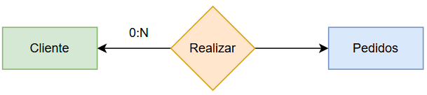
</p>

El resultado debe ser el siguiente:

<p align="center">
  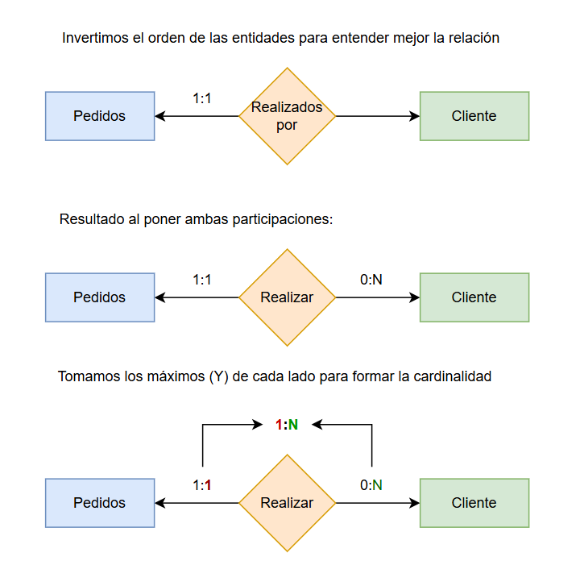
</p>

## Normalización de una base de datos

### Normalización 1FN

- Evitar grupos en a nivel de fila y columnas.
- Evitar los valores no atómicos, como por ejemplo una columna con datos separas por comas:
- Crear una tabla separada para cada grupo de registros de datos.
- Cada registro debe ser identificado por una llave primaria.

Valores no atómicos ❌:

| id  | nombre | teléfonos |
| --- | ------ | --------- |
| 1   | Ana    | 8888,9999 |

Campos repetidos o multivaluados ❌:

| id_persona | nombre | telefono1 | telefono2 | telefono3 |
| ---------- | ------ | --------- | --------- | --------- |
| 1          | Ana    | 8888      | 9999      | 7777      |

Registros no tiene llave primaria ❌
| nombre | correo |
| ------ | ------------------------------------- |
| Ana | [ana@gmail.com](mailto:ana@gmail.com) |
| Ana | [ana@gmail.com](mailto:ana@gmail.com) |

Ejemplo normalizado de una bd ✔️

Tabla `persona`

| id_persona (PK) | nombre |
| --------------- | ------ |
| 1               | Ana    |

Tabla `Teléfono`

| id_telefono (PK) | id_persona (FK) | telefono |
| ---------------- | --------------- | -------- |
| 1                | 1               | 8888     |
| 2                | 1               | 9999     |

### Normalización 2FN

Si una clave principal es una clave compuesta, el atributo que no es clave debe depender de cada columna de esa clave compuesta.

- Estar en 1FN (Primera forma normal)
- Identificar Claves Compuestas: Si tu tabla tiene una sola columna como PK (Clave Primaria), y ya está en 1FN, automáticamente está en 2FN.
- Si hay una columna que no se relaciona con todas las columnas de la clave compuesta, no está en 2fn.

Tabla con columna que depende parcialmente a la clave primaria ❌:

| id_estudiante | id_curso | nombre_estudiante | nombre_curso | creditos |
| ------------- | -------- | ----------------- | ------------ | -------- |
| 1             | 101      | Juan Pérez        | Matemáticas  | 4        |
| 1             | 102      | Juan Pérez        | Física       | 3        |
| 2             | 101      | Ana López         | Matemáticas  | 4        |
| 2             | 103      | Ana López         | Programación | 5        |

- nombre_estudiante depende solo de id_estudiante

- nombre_curso y creditos dependen solo de id_curso

- Hay dependencia parcial → NO cumple 2FN

Normalización a 2FN ✔️

_Tabla estudiante_

| id_estudiante | nombre_estudiante |
| ------------- | ----------------- |
| 1             | Juan Pérez        |
| 2             | Ana López         |

_Tabla curso_

| id_curso | nombre_curso | creditos |
| -------- | ------------ | -------- |
| 101      | Matemáticas  | 4        |
| 102      | Física       | 3        |
| 103      | Programación | 5        |

_Tabla inscripción_

| id_estudiante | id_curso |
| ------------- | -------- |
| 1             | 101      |
| 1             | 102      |
| 2             | 101      |
| 2             | 103      |

### Normalización 3FN

- Debe cumplor la primera y segunda forma normal.
- Una columna de una tabla no puede depender de otra columna que no sea clave.
- Evitar dependencia transitiva, si B depende de A y C depende de B, B no debería depender de A en una misma tabla.

Ejemplo de dependencia transitiva ❌

_Tabla departemento_
| id_empleado | nombre | id_departamento | nombre_departamento |
| ----------- | ------------ | --------------- | ------------------- |
| 1 | Juan Pérez | 10 | Contabilidad |
| 2 | Ana López | 20 | Recursos Humanos |
| 3 | Carlos Gómez | 10 | Contabilidad |

Normalización 3FN ✔️

_Tabla empleado_

| id_empleado | nombre       | id_departamento |
| ----------- | ------------ | --------------- |
| 1           | Juan Pérez   | 10              |
| 2           | Ana López    | 20              |
| 3           | Carlos Gómez | 10              |

_Tabla departamento_

| id_departamento | nombre_departamento |
| --------------- | ------------------- |
| 10              | Contabilidad        |
| 20              | Recursos Humanos    |

### Normalización Boyce-Codd

En Boyce-Codd, si una columna no clave es única y determina a otras columnas, entonces debe tratarse como una clave candidata.

| curso | profesor | aula |
| ----- | -------- | ---- |

Dependencias:

(curso, profesor) → aula ✅

profesor → aula ❌

✔ Cumple 3FN
❌ No cumple BCNF

👉 NO hay transitividad, pero sí falla BCNF

Un atributo o conjunto de atributos que identifica de forma única cada fila de una tabla y es mínimo. Las 3 primeras columnas se puede considerar candidatas:

| id_usuario | correo | dni | nombre |
| ---------- | ------ | --- | ------ |

### Cuarta forma normal

Si A tiene muchos B y muchos C, y B no tiene relación con C, no los pongas juntos.

Ejemplo sin normalizar en cuarta forma ❌:

| Empleado | Teléfono | Habilidad |
| -------- | -------- | --------- |
| Juan     | 1111     | Java      |
| Juan     | 1111     | SQL       |
| Juan     | 2222     | Java      |
| Juan     | 2222     | SQL       |

Corrección ✅

| Empleado | Teléfono |
| -------- | -------- |
| Juan     | 1111     |
| Juan     | 2222     |

| Empleado | Habilidad |
| -------- | --------- |
| Juan     | Java      |
| Juan     | SQL       |

## Transformaciones de entidad-relación a modelo relacional

### Caso de 1:1:

#### Primer caso: Ambos lados tiene relación de 1:1

- Pasa a ser una sola tabla
- La llave primaria puede ser cualquiera de las dos claves primarias.

**Tabla 1-2: EntidadPk1, EntidadPk2, Entidad1Atributos...**

<p align="center">
  
</p>

Entidad relación

<p align="center">
  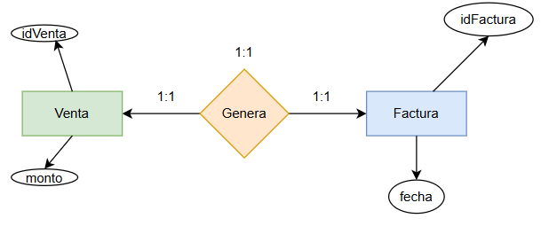
</p>

Diagrama relacional

<p align="center">
  
</p>

#### Segundo caso

- Si un lado es 0:1 y el otro lado es 1:1.
- Se pasa la clave primaria de la entidad 1:1 a la entidad con cardinalidad 0:1 como clave foránea.
- Se debe formar 2 tablas al final.

**Tabla 1: Entidad1Pk, Entidad2Atributos, `Entidad2Fk`**

**Tabla 2: Entidad2Pk, Entidad2Atri**

<p align="center">
  
</p>

Modelo entidad-relación

<p align="center">
  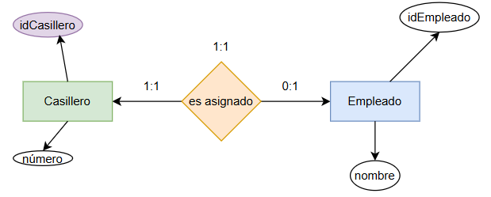
</p>

Modelo relacional

- En el caso de que a la hora de crear un usuario no permite no tener casillero (nulo).
- Un casillero puede existir y todavía no ser asignado a un empleado.

<p align="center">
  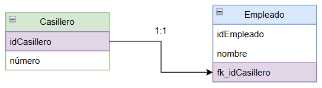
</p>

#### Tercer caso

- Cuando ambas relaciones son de 0:1.
- Cuando la relación tiene atributos.
- La relación se transforma en una tabla
- La clave primaria seria una compuesta, sería la concatenación de las llaves primarias de ambas entidades.
- Se forma 3 tablas al final.

<p align="center">
  
</p>

**Tabla 1: Entidad1Pk, Entidad1Atributos...**

**Tabla 2: Entidad2Pk, Entidad2Atri...**

**Relación: (Entidad1Pk, Entidad2Pk), AtributosDeLaRelación**

Modelo entidad-relación

- Un usuario puede no tener una oficina o tener y una oficina puede no ser reservada.

<p align="center">
  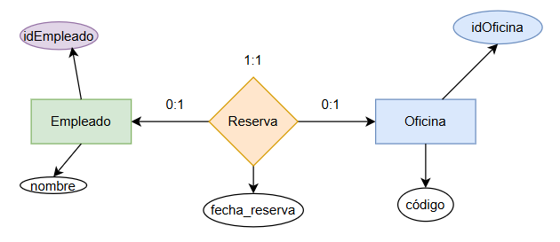
</p>

Modelo relacional

<p align="center">
  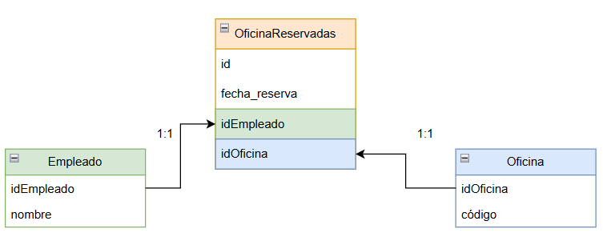
</p>

### Caso de 1:N

- Debe ubicar la relación que tiene en como _1_ en el máximo.

<p align="center">
  
</p>

#### Caso 1

<p align="center">
  
</p>

- Ubicar la cardinalidad mínima que tiene el máximo 1 y si tiene como 1:1
- Pasar la clave primaria de la cardinalidad mínima a la entidad con cardinalidad máxima _N_ como foránea.

- Los atributos de la relación pasa también a la cardinalidad máxima _N_.

- Al final quedan solo dos tablas

**Tabla 1: PrimariaEnt1**

**Tabla 2: PrimariaEnt2, PrimariaEnt1FK, AtributosDeLaRelación**.

Modelo entidad-relación

<p align="center">
  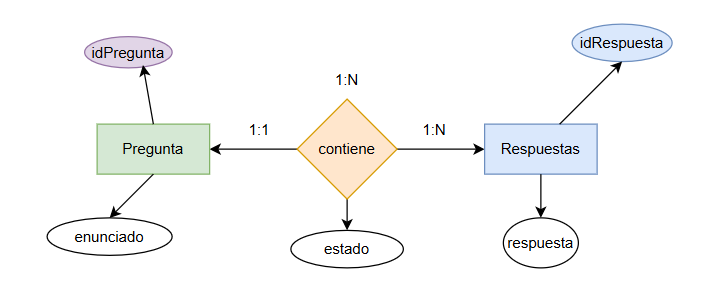
</p>

Modelo relacional

<p align="center">
  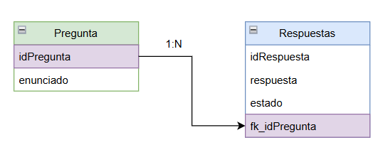
</p>

#### Caso 2:

<p align="center">
  
</p>

- Si la relación mínima tiene como cardinalidad _0:1_.
- La relación se vuelve una nueva tabla, la clave primaria de esta tabla va ser la clave primaria de la entidad que tiene como el máximo _N_.
- Los atributos de la relación se mantiene y la entidad con la cardinalidad máximo _1_ pasa a ser clave foránea de la nueva tabla.
  -Ambas claves primarias de las entidades quedan como foráneas en la tabla nueva.
- Deben quedar 3 tablas.

**Tabla 1: PrimariaEnt1**

**Tabla 2: PrimariaEnt2**

**Tabla relación: PrimariaEntFk2, atributos, primariaEntFk1**

Modelo entidad-relación

<p align="center">
  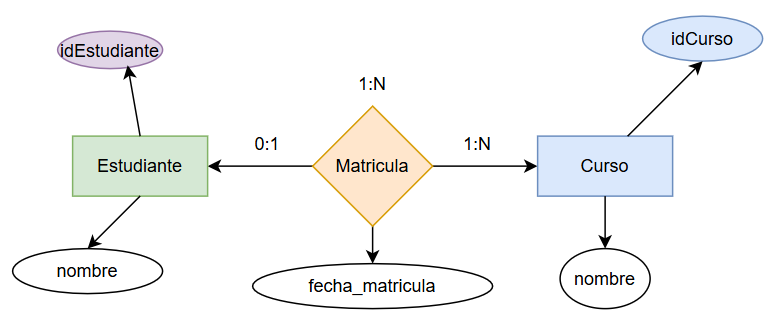
</p>

Modelo relacional

<p align="center">
  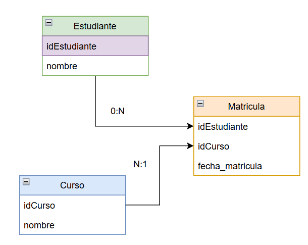
</p>

### Caso de N:M

- Cuando es muchos a muchos, la relación se transforma en una tabla nueva.
- Las demás tablas se mantienen.

#### Entidad-Relacion N:N

<p align="center">
  
</p>

#### Relacional

<p align="center">
  
</p>

## SQL

### DDL (Lenguaje de definción de datos)

#### Creación de una base de datos

```sql
CREATE DATABASE baseDatos;
```

#### Creación de una tabla

```sql
CREATE TABLE cliente (
    id_cliente INT AUTO_INCREMENT PRIMARY KEY,
    nombre VARCHAR(100) NOT NULL,
    correo VARCHAR(100) UNIQUE
);

/*Tabla con relación*/

CREATE TABLE pedido (
    id_pedido INT AUTO_INCREMENT PRIMARY KEY,
    fecha DATE,
    id_cliente INT,
    FOREIGN KEY (id_cliente) REFERENCES cliente(id_cliente)
);

/*Tabla con eliminación en cascada*/

CREATE TABLE pedido (
    id_pedido INT AUTO_INCREMENT PRIMARY KEY,
    fecha DATE,
    id_cliente INT,
    FOREIGN KEY (id_cliente)
        REFERENCES cliente(id_cliente)
        ON DELETE CASCADE
);
```

#### Creación de índices

```sql
/*Indice normal*/
ALTER TABLE usuario
ADD INDEX idx_nombre (nombre);

/*Indice único*/
ALTER TABLE usuario
ADD UNIQUE idx_correo (correo);

/*Indice compuesto*/
ALTER TABLE venta
ADD INDEX idx_cliente_fecha (id_cliente, fecha);

/*Mostra índices*/
SHOW INDEX FROM usuario;

/*Eliminar un indice*/
DROP INDEX idx_nombre ON usuario;

/*Índice para búsquedas de textos*/
ALTER TABLE articulo
ADD FULLTEXT idx_fulltext_articulo (titulo, contenido);


/*EJEMPLO DE USO FULLTEXT*/

SELECT *
FROM articulo
WHERE MATCH(titulo, contenido)
AGAINST ('mysql');


```

#### Modificación de columnas en tablas

```sql
/*Agregar columna*/
ALTER TABLE cliente
ADD telefono VARCHAR(20);

/*Modificar columna*/
ALTER TABLE cliente
MODIFY telefono VARCHAR(30) NOT NULL;


/*Cambiar el nombre*/
ALTER TABLE cliente
CHANGE telefono celular VARCHAR(30);


/*Eliminar columna*/
ALTER TABLE cliente
DROP telefono;

```

#### Cambiar el nombre a una tabla

```SQL
RENAME TABLE cliente TO clientes;
```

#### Eliminar base de datos y tabla

```SQL
/*BD*/
DROP DATABASE Tabla;

/*Tabla*/
DROP TABLE tabla;
```

#### Eliminar datos de una tabla

```SQL
/*Borrar todas las filas y su estructura*/
TRUNCATE TABLE tabla;

/*Borrar todo si la estructura*/
DELETE FROM tabla;
```

### Lenguaje de manipulación de datos

#### UPDATE

```SQL
UPDATE tabla
SET columna = 'Juan Perez';
```

#### INSERT

```SQL
INSERT INTO tabla (columna1, columna2)
VALUES ('Juan Pérez', 'juan@mail.com');

-- Otra forma
INSERT INTO Tabla (columna1, columna2) SELECT 'Juan Pérez', 'juan@mail.com';


```

#### DELETE

```SQL
DELETE FROM cliente
WHERE id_cliente = 3;
```

#### SELECT

```SQL
SELECT col1, col2 FROM tabla WHERE col2 = '2';
```

### Roles, usuarios y permisos.

#### Creación de un rol

```SQL
CREATE ROLE rol_lectura;
```

#### Asignación de permisos a un rol

```SQL
GRANT SELECT ON mi_base_datos.* TO rol_lectura;


/*Dar permiso el uso de un procedimiento*/
GRANT EXECUTE
ON PROCEDURE mi_base_datos.sp_listar_clientes
TO rol_lectura;

/*Ver permisos*/
SHOW GRANTS FOR rol_lectura;
```

| Categoría      | Permisos                       |
| -------------- | ------------------------------ |
| DML            | SELECT, INSERT, UPDATE, DELETE |
| DDL            | CREATE, DROP, ALTER, TRUNCATE  |
| Índices        | INDEX                          |
| Vistas         | CREATE VIEW, SHOW VIEW         |
| Rutinas        | EXECUTE                        |
| Triggers       | TRIGGER                        |
| Administración | ALL, GRANT OPTION              |

### Creación de un procedimiento almacenado

```SQL
CREATE PROCEDURE obtener_cliente(IN p_id INT)
BEGIN
    SELECT *
    FROM cliente
    WHERE id_cliente = p_id;
END$$

DELIMITER ;
```

### Creación de un procedimiento almacenado

```SQL
CREATE PROCEDURE obtener_cliente(IN p_id INT)
BEGIN
    SELECT *
    FROM cliente
    WHERE id_cliente = p_id;
END$$

DELIMITER ;

/*LLamar un procedimieto almacenado*/
CALL obtener_cliente(1);

```

### Procedimiento con validaciones

```SQL
DELIMITER $$

CREATE PROCEDURE transferencia()
BEGIN
    DECLARE EXIT HANDLER FOR SQLEXCEPTION
    BEGIN
        ROLLBACK;
        SELECT 'Error, rollback ejecutado';
    END;

    START TRANSACTION;

    IF (SELECT saldo FROM cuenta WHERE id = 1) < 100 THEN
        SIGNAL SQLSTATE '45000'
        SET MESSAGE_TEXT = 'Fondos insuficientes';
    END IF;

    UPDATE cuenta SET saldo = saldo - 100 WHERE id = 1;
    UPDATE cuenta SET saldo = saldo + 100 WHERE id = 2;

    COMMIT;
END$$

DELIMITER ;

```

### Funciones

```SQL
DELIMITER $$

CREATE FUNCTION calcular_iva(precio DECIMAL(10,2))
RETURNS DECIMAL(10,2)
DETERMINISTIC
BEGIN
    RETURN precio * 0.13;
END$$

DELIMITER ;

/*Usar la función*/
SELECT calcular_iva(100);
```

### Vistas

```SQL
/*Crear una vista*/
CREATE VIEW vista_clientes AS
SELECT id_cliente, nombre, correo
FROM cliente;

/*Usar la vista*/
SELECT * FROM vista_clientes;

/*Eliminar la vista*/
DROP VIEW vista_clientes;
```

### Triggers

#### Despues de un evento

```SQL
DELIMITER $$

CREATE TRIGGER trg_usuario_update
AFTER UPDATE ON usuario
FOR EACH ROW
BEGIN
    INSERT INTO log_cambios(descripcion)
    VALUES ('Usuario actualizado');
END$$

DELIMITER ;
```

#### Antes de un evento

```SQL
CREATE TRIGGER trg_before_update
BEFORE UPDATE ON producto
FOR EACH ROW
SET NEW.precio = NEW.precio * 1.10;

```

#### Trigger llamado un procedimiento

```SQL
DELIMITER $$

CREATE TRIGGER trg_after_insert_usuario
AFTER INSERT ON usuario
FOR EACH ROW
BEGIN
    CALL registrar_log(CONCAT('Usuario creado: ', NEW.nombre));
END$$

DELIMITER ;

```

### Transacciones

```sql
START TRANSACTION;

UPDATE cuenta
SET saldo = saldo - 100
WHERE id_cuenta = 1;

UPDATE cuenta
SET saldo = saldo + 100
WHERE id_cuenta = 2;

COMMIT;
```

#### Anular o cancelar cambios con rollback

```sql
START TRANSACTION;

UPDATE cuenta SET saldo = saldo - 100 WHERE id = 1;
UPDATE cuenta SET saldo = saldo + 100 WHERE id = 2;

ROLLBACK; /*Ningún dato se modifica*/
```

### Condicionales IF-ELSE

```sql
IF saldo < 0 THEN
   SIGNAL SQLSTATE '45000'
   SET MESSAGE_TEXT = 'Saldo inválido';
END IF;
```

### Tablas temporales

```SQL
CREATE TEMPORARY TABLE temp_ventas (
    id INT,
    total DECIMAL(10,2)
);

/*CTes*/
WITH nombre_cte AS (
    SELECT columnas
    FROM tabla
)
SELECT *
FROM nombre_cte;
```

### Variables

```SQL

/*Para fuera de procedimientos y funciones*/
SET @contador = 10;
SELECT @contador;

/*Dentro de procedimiento*/
DECLARE total INT;
SET total = 100;

/*Con select*/
SELECT COUNT(*) INTO total FROM cliente;
```

### BUCLE FOR

```SQL
DELIMITER $$

CREATE PROCEDURE ejemplo_for()
BEGIN
    DECLARE i INT;

    FOR i IN 1..5 DO
        SELECT i;
    END FOR;
END$$

DELIMITER ;
```

### Cláusulas

- **SELECT**: define qué columnas se muestran
- **DISTINCT**: elimina filas duplicadas
- **FROM**: indica la tabla de origen
- **JOIN / ON**: une tablas relacionadas
- **WHERE**: filtra filas
- **GROUP BY**: agrupa resultados
- **HAVING**: filtra grupos
- **ORDER BY**: ordena el resultado
- **LIMIT / OFFSET**: limita la cantidad de filas

### Operadores

- **LIKE**: busca patrones en texto
- **IN**: compara con una lista de valores
- **BETWEEN**: verifica si un valor está en un rango
- **IS NULL**: verifica si el valor es nulo
- **IS NOT NULL**: verifica si no es nulo
- **=**: igual a
- **<> / !=**: diferente de
- **>**: mayor que
- **<**: menor que
- **>=**: mayor o igual
- **<=**: menor o igual
- **EXISTS**: verifica si una subconsulta devuelve filas
- **ANY / SOME**: compara con cualquier valor de una subconsulta
- **ALL**: compara con todos los valores de una subconsulta

### Ejemplo de uso de GROUP BY

| id_venta | cliente | total |
| -------- | ------- | ----- |
| 1        | Ana     | 100   |
| 2        | Juan    | 200   |
| 3        | Ana     | 150   |
| 4        | Juan    | 300   |
| 5        | Luis    | 50    |

Consulta

```SQL
SELECT cliente, SUM(total) AS total_compras
FROM ventas
GROUP BY cliente;
```

Resultado

| cliente | total_compras |
| ------- | ------------- |
| Ana     | 250           |
| Juan    | 500           |
| Luis    | 50            |

### EJemplode paginación con OFFSET

| id_producto | nombre     | precio |
| ----------- | ---------- | ------ |
| 1           | Lapiz      | 10     |
| 2           | Cuaderno   | 20     |
| 3           | Borrador   | 5      |
| 4           | Resaltador | 15     |
| 5           | Tijeras    | 25     |
| 6           | Pegamento  | 12     |

Página 1 con dos registros

```SQL
SELECT *
FROM productos
ORDER BY id_producto
LIMIT 2 OFFSET 0;

```

Resultado:
| id_producto | nombre | precio |
| ----------- | -------- | ------ |
| 1 | Lapiz | 10 |
| 2 | Cuaderno | 20 |

Página 2 con dos registros

```SQL
SELECT *
FROM productos
ORDER BY id_producto
LIMIT 2 OFFSET 2;

```

Resultado:

| id_producto | nombre     | precio |
| ----------- | ---------- | ------ |
| 3           | Borrador   | 5      |
| 4           | Resaltador | 15     |

### Uso del Having para filtrar

| cliente | total |
| ------- | ----- |
| Ana     | 100   |
| Ana     | 150   |
| Juan    | 200   |
| Juan    | 300   |
| Luis    | 50    |

```SQL
SELECT cliente, SUM(total) AS total_compras
FROM ventas
GROUP BY cliente
HAVING SUM(total) > 200;
```

Resultado:

| cliente | total_compras |
| ------- | ------------- |
| Ana     | 250           |
| Juan    | 500           |

### Uso del Between para filtrar

| id_producto | nombre     | precio |
| ----------- | ---------- | ------ |
| 1           | Lapiz      | 10     |
| 2           | Cuaderno   | 20     |
| 3           | Borrador   | 5      |
| 4           | Resaltador | 15     |
| 5           | Tijeras    | 25     |

```SQL
SELECT *
FROM productos
WHERE precio BETWEEN 10 AND 20;
```

Resultado

| id_producto | nombre     | precio |
| ----------- | ---------- | ------ |
| 1           | Lapiz      | 10     |
| 2           | Cuaderno   | 20     |
| 4           | Resaltador | 15     |

### Uso del LIKE

```SQL
WHERE nombre LIKE 'Ana%'   -- Empieza con "Ana"
WHERE nombre LIKE '%Pérez' -- Termina con "Pérez"
WHERE nombre LIKE 'A_a%'   -- Empieza con A, cualquier letra en medio, luego 'a'
```

### Uso del IN

```PostgreSQL
-- Buscar clientes que estén en Madrid o Sevilla
SELECT *
FROM clientes
WHERE ciudad IN ('Madrid', 'Sevilla');

```

### Subconsultas

#### ANY o SOME

```SQL
-- Seleccionar productos cuyo precio sea mayor que **alguno** de estos valores
SELECT *
FROM producto
WHERE precio > ANY (SELECT precio FROM oferta);

```

#### ALL

```SQL
-- Seleccionar productos cuyo precio sea mayor que **todos** los precios de la subconsulta
SELECT *
FROM producto
WHERE precio > ALL (SELECT precio FROM oferta);
```

### JOINS


<p align="center">
  
</p>

#### INNER JOIN

$$A \cap B$$


```SQL
SELECT A.nombre, B.producto
FROM TablaA AS A
INNER JOIN TablaB AS B ON A.id = B.id;
```


<p align="center">
  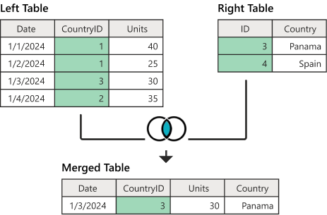
</p>

#### LEFT JOIN
$$A \cup (A \cap B)$$

```sql

SELECT A.nombre, B.producto
FROM TablaA AS A
LEFT JOIN TablaB AS B ON A.id = B.id;

```
<p align="center">
  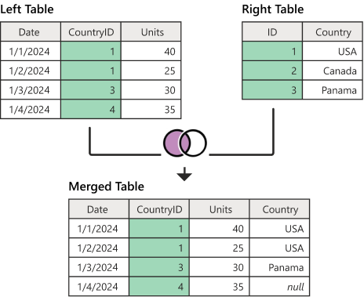
</p>

#### RIGHT JOIN


$$B \cup (A \cap B)$$

```SQL
SELECT A.nombre, B.producto
FROM TablaA AS A
RIGHT JOIN TablaB AS B ON A.id = B.id;
```

<p align="center">
  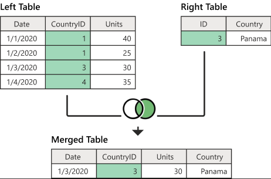
</p>

#### FULL JOIN

**$$FULL JOIN = LEFT JOIN \cup RIGHT JOIN$$**


```SQL
SELECT
    A.id,
    A.valor_A,
    B.valor_B
FROM A
LEFT JOIN B ON A.id = B.id

UNION

SELECT
    A.id,
    A.valor_A,
    B.valor_B
FROM A
RIGHT JOIN B ON A.id = B.id;
```

<p align="center">
  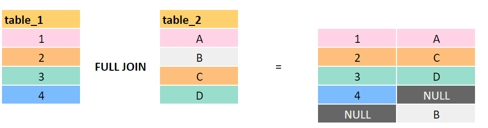
</p>


#### RIGHT ANTI JOIN (EXCLUDING)

$$B - (A \cap B) \quad \text{o simplemente} \quad B - A$$

```SQL
SELECT b.*
FROM TableA a
RIGHT JOIN TableB b
  ON a.id = b.id
WHERE a.id IS NULL;
```

<p align="center">
  
</p>


#### LEFT ANTI JOIN (EXCLUDING)

$$A - B$$

```SQL
SELECT a.*
FROM TableA a
LEFT JOIN TableB b
  ON a.id = b.id
WHERE b.id IS NULL;

-- Otra forma
SELECT *
FROM TableA a
WHERE NOT EXISTS (
  SELECT 1
  FROM TableB b
  WHERE b.id = a.id
);

```


<p align="center">
  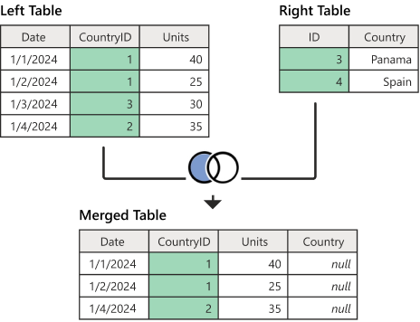
</p>


#### CROSS JOIN (Producto Cartesiano)
$$A \times B$$

```SQL
SELECT * FROM A CROSS JOIN B;
```
<p align="center">
  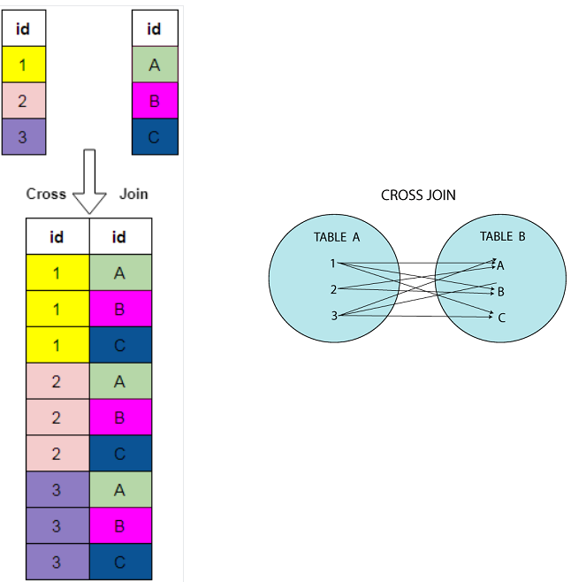
</p>


#### DIFERENCIA SIMÉTRICA
$$A \Delta B = (A - B) \cup (B - A)$$

$$A \Delta B = (A \cup B) - (A \cap B)$$

```sql
-- Registros solo en A
SELECT
  a.Fecha,
  a.CountryID,
  a.Units,
  NULL AS B_ID,
  NULL AS B_COUNTRY
FROM A a
LEFT JOIN B b ON a.CountryID = b.ID
WHERE b.ID IS NULL

UNION

-- Registros solo en B
SELECT
  NULL AS Fecha,
  NULL AS CountryID,
  NULL AS Units,
  b.ID AS B_ID,
  b.COUNTRY AS B_COUNTRY
FROM B b
LEFT JOIN A a ON b.ID = a.CountryID
WHERE a.CountryID IS NULL;
```

Sin incluir todas las columnas
```SQL

-- A − B
SELECT A.Fecha, A.CountryID, A.Units
FROM A
LEFT JOIN B ON A.CountryID = B.ID
WHERE B.ID IS NULL

UNION

-- B − A
SELECT NULL AS Fecha, B.ID AS CountryID, NULL AS Units
FROM B
LEFT JOIN A ON B.ID = A.CountryID
WHERE A.CountryID IS NULL;
```

<p align="center">
  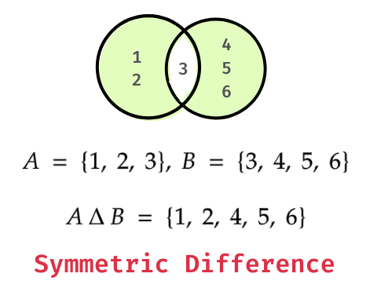
</p>


## Referencias

Elmasri, R., & Navathe, S. (2007). Fundamentos de sistemas de bases de datos. ADDISON WESLEY. https://ia802808.us.archive.org/8/items/fundamentosdesistemasdebasesdedatos/Fundamentos-de-Sistemas-de-Bases-de-Datos.pdf página 7

Gomstyn, A., & Jonker, A. (2025, 27 noviembre). Normalización de bases de datos. IBM. https://www.ibm.com/mx-es/think/topics/database-normalization
