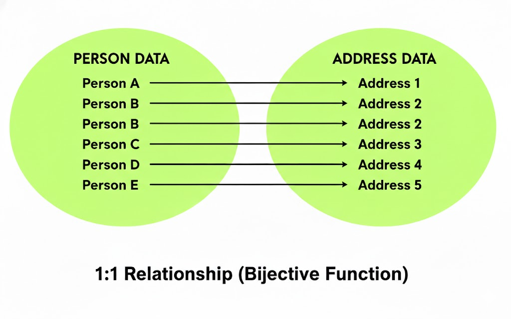
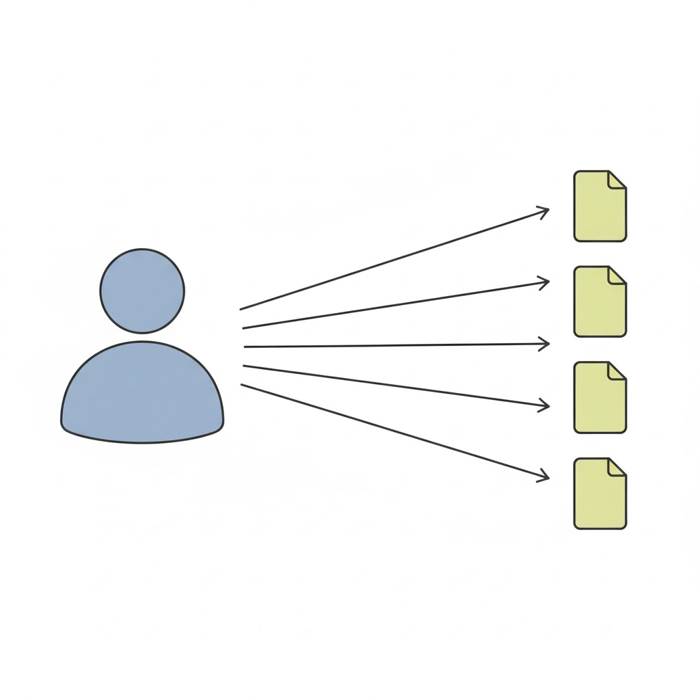
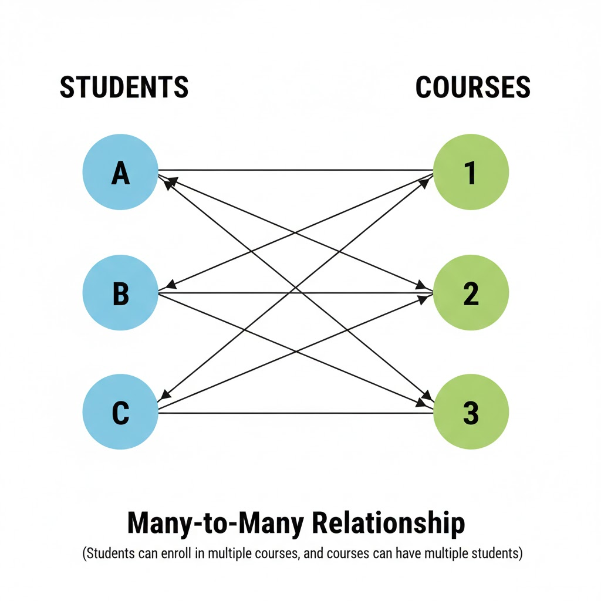

# Base de datos: cardinalidad, normalización, transformación de ER-Relacional y SQL Joins.

## Cardinalidad de una relación

### Cardinalidad 1:1
Cuando un registro se relaciona sólamente con otro de otra tabla y viceversa.

Ejemplo:
- Una persona solo puede tener un pasaporte y uno pasaporte solo le pertenece a una sóla persona.

Esto depende de igual manera el diseño de la base de datos, porque una persona puede tener varios pasaportes, como en el caso de que uno esta activo y el resto expirados o en el caso de que posea pasaportes de diferentes nacionalidades.

- Un usuario solo puede tener una cédula.
- Un usurio solo tiene un rol.
- Un usuario tiene una sola dirección

  

---

### Cardinalidad 1:N
Un solo registro de una tabla A iene asociaciones con varios registros de la tabla B, los registros de la tabla B solo puede asociarse al registro de la tabla **A**.

Ejemplo:
- Un usuario tiene muchas cuentas.
- Una compra les pertenece a un usuario

  

### Cardinalidad N:M

Cuando varios registros de una tabla pueden relacionarse con varios registros de otra tabla.

- Un estudiante puede inscribirse en muchos cursos y Un curso tiene muchos estudiantes.

- Un comprador puede comprar varios producto y un producto puede ser comprado por varios compradores.

- Un paciente puede ser atentido por muchos médicos y un médico puede atender a muchos pacientes.

  

### Cardinalidad 0:1
Se usa cuando una entidad puede o no tener una relación, y si la tiene, es solo una.

- Una cuenta de red social solo puede tener una foto de perfil o no tener ninguna.
- Un usuario puede tener licencia de conducir o nada.

### Cardinalidad 0:N

Se usa cuando una entidad puede no tener ninguna relación, o puede tener muchas, sin un límite máximo.

- Un cliente puede no haber hecho pedidos o haber hecho muchos pedidos.

- Una categoria creada puede no tener productos o puede estar asociada con muchos.

## Normalización de una base de datos

### Normalización 1FN

- Evitar grupos en a nivel de fila y columnas. 
- Evitar los valores no atómicos, como por ejemplo una columna con datos separas por comas:
- Cada registro debe ser identificado por una llave primaria.

Valores no atómicos ❌:

| id | nombre | teléfonos |
| -- | ------ | --------- |
| 1  | Ana    | 8888,9999 |

Campos repetidos o multivaluados ❌: 

| id_persona | nombre | telefono1 | telefono2 | telefono3 |
| ---------- | ------ | --------- | --------- | --------- |
| 1          | Ana    | 8888      | 9999      | 7777      |

Registros no tiene llave primaria ❌
| nombre | correo                                |
| ------ | ------------------------------------- |
| Ana    | [ana@gmail.com](mailto:ana@gmail.com) |
| Ana    | [ana@gmail.com](mailto:ana@gmail.com) |

